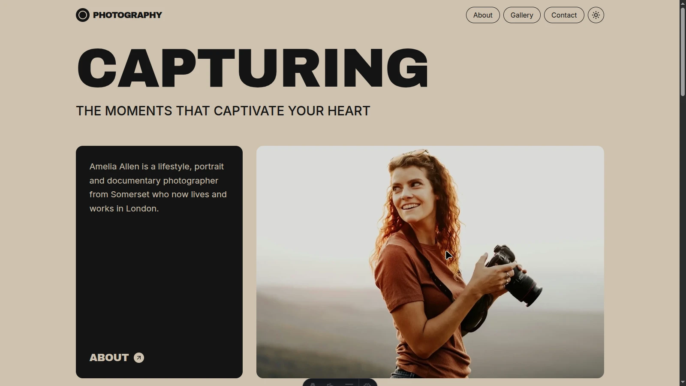

# 📸 Photographer Portfolio

A modern and elegant **photographer portfolio website** built with **Astro** and **Tailwind CSS**.  
This project showcases professional photography collections, an about page, and a contact form, all within a clean and responsive design.  

---

## 🚀 Features

- 🎨 **Modern UI/UX** with custom components and Tailwind CSS.  
- 📱 **Fully responsive** across all devices.  
- 🖼️ **Project gallery** with individual collection detail pages.  
- 📝 **About page** with professional background and storytelling.  
- 📬 **Contact form** with basic HTML validation.  
- 🌍 **SEO optimized** meta descriptions for better visibility.  

---

## 🛠️ Tech Stack

- **Framework:** [Astro](https://astro.build/)  
- **Styling:** [Tailwind CSS](https://tailwindcss.com/)  
- **Deployment:** Vercel (recommended)  

---
